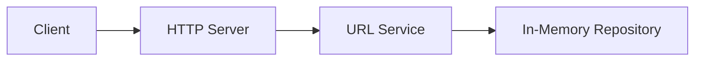

## 🌥️ Яндекс Практикум: Cloud Native Go Workshop

Материалы для вебинара по Cloud Native программированию на Go от Яндекс Практикума. Этот проект демонстрирует создание минималистичного URL-сервиса сокращения ссылок с акцентом на принципы простоты, наблюдаемости и удобства разработки.

### 📋 Содержание

- **[Описание проекта](#-описание-проекта)**
- **[Архитектура](#️-архитектура)**
- **[Технологии](#-технологии)**
- **[Быстрый старт](#-быстрый-старт)**
- **[Разработка](#-разработка)**
- **[API Документация](#-api-документация)**
- **[Конфигурация](#️-конфигурация)**
- **[Мониторинг](#-мониторинг)**
- **[Презентация](#-презентация)**
- **[Материалы](#-материалы)**

## 🎯 Описание проекта

URL Shortener — это учебное приложение на Go, иллюстрирующее:

- 🏗️ **12-Factor App принципы**: конфигурация через переменные окружения, stateless-сервис
- 🧪 **Надёжные тесты**: unit-тесты с `-race` и покрытием
- 🧰 **Developer ergonomics**: Taskfile для типовых задач разработки
- 🧱 **Чёткая модульность**: `internal/*` разделение на слои API/домен/репозиторий

В текущей версии используется **in-memory** хранилище (для простоты и скорости старта). Интерфейсы допускают замену на внешнее хранилище (например, PostgreSQL) без изменений бизнес-логики.

### Основные возможности

- Создание коротких ссылок из длинных URL (`POST /` с body в виде строки URL)
- Перенаправление по коротким ссылкам (`GET /{id}`)
- Graceful shutdown

## 🏗️ Архитектура



### Компоненты

- **HTTP Server** — обработка `POST /` и `GET /{id}`
- **URL Service** — бизнес-логика сокращения и получения ссылок
- **In-Memory Storage** — хранение соответствий id ↔️ URL в памяти процесса
- **Configuration** — 12-factor совместимая конфигурация (env + flags)

## 🛠 Технологии

### Backend

- **Go 1.22+** — основной язык
- **net/http** — встроенный HTTP-сервер

### DevX

- **Task** — автоматизация задач (`Taskfile.yml`)
- **go test** — тестирование с race detector и покрытием

При желании можно дополнить проект Docker/Kubernetes/Observability-практиками — код организован так, чтобы это было просто.

## 🚀 Быстрый старт

### Предварительные требования

- Go 1.23+ (или совместимая версия)
- Task (`https://taskfile.dev`)

### Установка и запуск

```bash
# Установить зависимости
go mod download

# Запуск в dev-режиме
task run

# Сборка бинарника
task build

# Тесты (race + coverage)
task test
```

Сервис поднимется на адресе, заданном `SERVER_ADDRESS` (по умолчанию `:8080`).

## 💻 Разработка

### Структура проекта (сокращённо)

```
├── cmd/shortener/          # Точка входа приложения
├── internal/
│   ├── api/                # HTTP-обработчики
│   ├── config/             # Конфигурация (env + flags)
│   ├── repository/         # In-memory хранилище
│   └── url/                # Домен: сущности и сервис URL
├── presentation/           # Материалы вебинара (Slidev)
└── Taskfile.yml            # Команды разработчика
```

### Доступные команды (Task)

```bash
task run      # Запуск приложения
task build    # Сборка бинарника в bin/shortener
task test     # Тесты с race и покрытием
task lint     # Vet + fmt + goimports
task gen      # Генерация (mocks и т.п.)
```

## 📡 API Документация

### Создание короткой ссылки

```bash
POST /
Content-Type: text/plain

https://example.com/very/long/url
```

Ответ:

```
HTTP/1.1 201 Created
Content-Type: text/plain

http://localhost:8080/abc12345
```

> Примечание: тело запроса — это URL как обычная строка (поддерживается URL-encoded строка).

### Переход по короткой ссылке

```bash
GET /{id}
```

Ответ:

```
HTTP/1.1 307 Temporary Redirect
Location: https://example.com/very/long/url
```

## ⚙️ Конфигурация

Приложение настраивается через переменные окружения и/или флаги командной строки (flags имеют приоритет):

| Переменная       | Описание                             | По умолчанию            |
|------------------|--------------------------------------|-------------------------|
| `APP_NAME`       | Имя приложения                       | `shortener`             |
| `SERVER_ADDRESS` | Адрес сервера                        | `:8080`                 |
| `BASE_URL`       | Базовый URL сервиса                  | `http://localhost:8080` |
| `LOG_LEVEL`      | Уровень логирования                  | `info`                  |
| `ENVIRONMENT`    | Окружение                            | `development`           |
| `VERBOSE`        | Подробный вывод                      | `false`                 |

Флаги командной строки:

```bash
./shortener -h

  -a string   Server address
  -b string   Base URL
  -v          Verbose output
```

## 📊 Мониторинг

Сервис пишет структурированные логи через стандартный логгер. Для production можно интегрировать Zap/zerolog и метрики Prometheus — архитектура приложения это упрощает.

> Health/readiness эндпоинты можно добавить поверх текущего `http.ServeMux` (например, `GET /healthz`, `GET /readyz`).

## 🎓 Презентация

Материалы вебинара находятся в `presentation/` и собраны с помощью Slidev.

```bash
cd presentation
npm install
npm run dev    # Режим разработки
npm run build  # Сборка статических файлов
```

## 📚 Материалы

### Рекомендуемое чтение

- [Go Proverbs](https://go-proverbs.github.io/)
- [Unix Philosophy](https://en.wikipedia.org/wiki/Unix_philosophy)
- [Domain Driven Design](https://martinfowler.com/bliki/DomainDrivenDesign.html)
- [Solid Go design by Dave Cheney](https://dave.cheney.net/2016/08/20/solid-go-design)
- [Go Project Layout](https://github.com/golang-standards/project-layout)
- [The Twelve Factors](https://12factor.net/)
- [CNCF Cloud Native Definition](https://www.cncf.io/about/who-we-are/)


## 🤝 Участие в разработке

Этот проект — образовательный материал. Нашли проблему или хотите улучшить пример?

1. Сделайте Fork
2. Создайте feature-ветку
3. Внесите изменения
4. Создайте Pull Request

## 📄 Лицензия

Проект распространяется под лицензией MIT. См. `LICENSE` (если отсутствует — используйте MIT по умолчанию).

## 👨‍💻 Автор

**Евгений Гребенников**
- GitHub: [@vokinneberg](https://github.com/vokinneberg)

---

<div align="center">
  <strong>🌟 Архитектура Go прокета | Яндекс Практикум 🌟</strong>
  <br/>
  <sub>Версия и базовая структура ориентированы на простоту и расширяемость.</sub>
</div>
